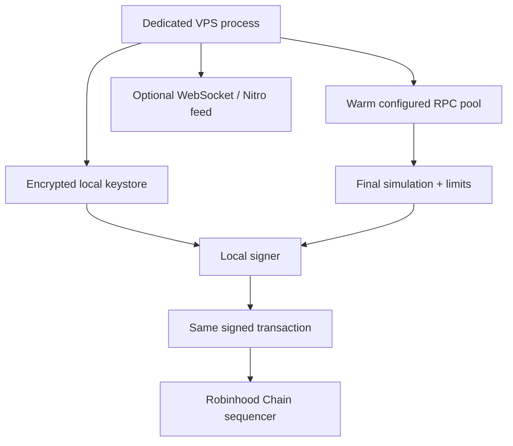

# Robinhood Chain NFT Sniper

A security-first, VPS-native NFT mint bot specialized for **Robinhood Chain**. It stays prepared before a legitimate public mint opens, then performs the minimum safe hot path:

```text
trigger -> verify chain/state -> refresh nonce/fee/balance -> simulate -> enforce limits -> sign locally -> broadcast -> track
```

It does not automate a Robinhood account, bypass allowlists, create proofs, bypass wallet limits, solve CAPTCHAs, exploit contracts, or guarantee a mint. It interacts only with public EVM contracts and configured RPC infrastructure.

> **Real-money warning:** Treat this as early-stage software. Start on testnet, use a brand-new low-value wallet, inspect the target ABI, run `doctor` and `arm --dry-run`, and keep the default `watch` mode until you understand every configured value.

## Why this is faster than a normal mint bot

| Normal bot after detection | This sniper before activation |
|---|---|
| Starts the process | Process is already resident on the VPS |
| Loads the ABI and creates the contract object | ABI is loaded and mint function resolved |
| Builds all calldata | Static calldata is precomputed |
| Opens RPC connections | HTTP connection pools and DNS cache are warm |
| Selects an RPC from one ping | Configured RPCs are scored by latency, reliability and block freshness |
| Fetches every input sequentially | Nonce, gas price, balance and chain ID refresh concurrently |
| May broadcast without a final check | Final `eth_call` simulation is mandatory |
| Often trusts a mutable “max gas” UI | Price, fee and total-spend limits are enforced in the execution path |
| May keep a plaintext key in source or `.env` | Encrypted local keystore and hidden password prompt |
| Can double-submit after restart | Persistent wallet/contract/nonce state and explicit rearm |

Robinhood Chain documents a first-come-first-served sequencing model. Reducing avoidable client-side preparation delay can therefore matter. It still cannot guarantee network arrival order, successful inclusion, availability, allocation, profit, or ownership. Other users may be closer to the sequencer, target state can change between simulation and execution, and the network or mint contract can reject the transaction.

## Security and speed are designed together

- **No custody backend:** the application has no server that receives a key.
- **Local signing:** the key is decrypted only in the running VPS process at signing time.
- **Encrypted at rest:** Web3-compatible keystore, password protected, directory mode `700`, file mode `600`.
- **No secrets in SQLite:** state stores public wallet, contract, nonce, hash, state and timings only.
- **Central redaction:** private-key-shaped strings, Telegram tokens and common RPC credentials are removed from logs/output.
- **Warm safe path:** ABI parsing, address validation and calldata encoding happen before activation.
- **No unsafe speed trick:** simulation and hard limits are never skipped; retries cannot raise limits.
- **Same-transaction redundancy:** at most two healthy configured RPCs receive the same signed raw transaction. No competing nonces or replacement spam.
- **Strict network lock:** only chain IDs `46630` (testnet) and `4663` (mainnet) are accepted.
- **No arbitrary endpoint discovery:** the pool uses only endpoints you configure.

Read [SECURITY.md](SECURITY.md) and [docs/security.md](docs/security.md) before using a funded wallet.

## Supported networks

| Network | Chain ID | Native gas | Public RPC | Use |
|---|---:|---|---|---|
| Robinhood Chain Testnet | 46630 | ETH | `https://rpc.testnet.chain.robinhood.com` | First run, recommended |
| Robinhood Chain Mainnet | 4663 | ETH | `https://rpc.mainnet.chain.robinhood.com` | Real funds; explicit confirmation |

Public endpoints may be rate-limited. Use a reputable custom HTTPS RPC plus one or two backups and a WebSocket RPC for a production attempt. Never paste provider credentials into a public issue or screenshot.

## Exact VPS installation

Recommended host: a clean Ubuntu 24.04 LTS VPS in a region with low measured latency to your configured provider. Ubuntu 22.04 works after installing Python 3.12 from a trusted package source.

### 1. Create a non-root user

From your VPS provider console or root shell:

```bash
adduser sniper
usermod -aG sudo sniper
rsync --archive --chown=sniper:sniper ~/.ssh /home/sniper
```

Open a second terminal and verify SSH access as `sniper` before disabling any access method.

### 2. Harden the VPS

At minimum: SSH keys only, provider-account MFA, automatic security updates, firewall, time sync, no unrelated applications, and no shared admin users. Apply a small baseline directly:

```bash
sudo apt update
sudo apt install -y ufw fail2ban unattended-upgrades chrony
sudo ufw default deny incoming
sudo ufw default allow outgoing
sudo ufw allow OpenSSH
sudo ufw --force enable
sudo systemctl enable --now fail2ban chrony
```

Do not run random “optimization” scripts. Do not install browser extensions, cracked software, trading panels, or Telegram bots on this VPS.

### 3. Install Python and Git

Ubuntu 24.04:

```bash
sudo apt update
sudo apt install -y git python3 python3-venv python3-pip build-essential chrony
sudo systemctl enable --now chrony
```

Verify Python 3.12 or newer:

```bash
python3 --version
```

### 4. Clone and inspect

```bash
git clone https://github.com/gowthamaran/Robinhood-nft-sniper.git
cd Robinhood-nft-sniper
git log -1 --oneline
less SECURITY.md
less install.sh
less scripts/vps_harden.sh
```

For stronger supply-chain control, pin the commit SHA you reviewed before installing.

### 5. Install

```bash
bash install.sh
export PATH="$HOME/.local/bin:$PATH"
robinhood-sniper --help
```

Persist the PATH line in your shell profile if needed. The installer creates a project virtual environment and `~/.robinhood-sniper/{secrets,logs,state}` with restrictive modes.

### 6. Prepare inputs offline

Have these ready:

1. Testnet or mainnet selection.
2. Custom HTTPS RPC and optional backups from providers you chose.
3. Optional WebSocket RPC.
4. A new dedicated low-value wallet private key.
5. A strong, unique keystore password (12+ characters; a password manager-generated phrase is better).
6. Exact NFT contract address on the selected chain.
7. Verified ABI JSON file. Never use guessed calldata.
8. Exact mint function, ordered arguments, exact transaction value, quantity and hard limits.
9. Any legitimate proof, signature or voucher issued to your wallet. The bot does not create authorization.

### 7. Run secure setup

```bash
robinhood-sniper setup
```

The key prompt is hidden. Paste it only into that local VPS prompt. Do not pass it as a CLI argument, send it to Telegram, commit it, put it in a support ticket, or share it with anyone claiming to “configure the bot.”

The optional `ROBINHOOD_SNIPER_PRIVATE_KEY` environment variable exists for advanced ephemeral automation but is less safe at rest and will make `security-check` fail. The encrypted keystore is the normal path.

### 8. Verify before arming

```bash
robinhood-sniper security-check
robinhood-sniper doctor
robinhood-sniper benchmark --rounds 5
robinhood-sniper config show
robinhood-sniper wallet status
```

`doctor` validates config, chain ID, RPC availability, bytecode, wallet balance, ABI/function, local permissions, SQLite and time synchronization. Any critical failure means **NOT READY**.

### 9. Dry-run on testnet

```bash
robinhood-sniper arm --dry-run --watch-timeout 300
```

This monitors until `eth_call` indicates the configured mint would succeed, refreshes dynamic data, estimates gas, enforces hard limits and reports real timings. It does not sign or broadcast.

### 10. Choose execution mode

The wizard writes one of:

- `watch`: alerts/status and dry calculations; never signs or broadcasts.
- `confirm`: final simulation and limits, then asks in the terminal before signing.
- `auto`: signs/broadcasts only after every check passes. Setup requires typing `ENABLE AUTO`.

Edit mode by rerunning setup for now. Never switch to auto before a successful testnet dry run and a full review of `config show`.

### 11. Arm

Keep the terminal attached with `tmux` for initial tests:

```bash
sudo apt install -y tmux
tmux new -s sniper
robinhood-sniper arm
```

Detach with `Ctrl-b`, then `d`; reconnect with:

```bash
tmux attach -t sniper
```

After a broadcast, the duplicate guard prevents another execution for the same wallet/target. A second attempt requires:

```bash
robinhood-sniper arm --rearm
```

This asks for explicit confirmation. Rearm can mint again; use it only when intentional.

## Target configuration

Change the target without rerunning wallet setup:

```bash
robinhood-sniper target set \
  0xYourContract \
  /absolute/path/to/verified-abi.json \
  mint \
  --arguments-json '[1]' \
  --quantity 1 \
  --value-eth 0.05
```

Then rerun:

```bash
robinhood-sniper doctor
robinhood-sniper arm --dry-run
```

Argument order and types must match exactly. A mint requiring a Merkle proof, server voucher or signed authorization works only when the legitimate value issued for this wallet is supplied. Missing authorization is a stop condition.

## RPC race and failover

The pool measures configured endpoints across repeated probes. Its score combines:

- rolling request latency;
- success/failure rate;
- current block freshness.

The hot path tries endpoints in current health order. The signed raw transaction is sent to at most the top two configured endpoints; both carry the identical hash and nonce. A timeout or duplicate response does not create a different transaction. Benchmark is read-only:

```bash
robinhood-sniper benchmark --rounds 10
```

One low ping is not enough. Test near the actual event time and watch reliability/block lag.

## Sequencer feed

Robinhood publishes a Nitro sequencer feed at `wss://feed.{network}.chain.robinhood.com`. This is not a standard Ethereum `eth_subscribe` socket. The included listener understands the outer Nitro JSON broadcast envelope for health/sequence observations; it deliberately does not pretend to decode every compressed transaction.

Execution uses final RPC state and simulation and never depends solely on the feed. The documented sequencer RPC endpoint can accept raw transactions, but this release does not route directly to it automatically. That behavior should be enabled only after compatibility and failure handling are tested for Robinhood Chain. See [docs/sequencer.md](docs/sequencer.md).

## Systemd service

Initial setup/password entry is interactive. A systemd service cannot safely ask for a keystore password after reboot. Use `tmux` for the safest default. The unit generator supports non-interactive operation only when an approved secret-injection method is available; do not put the password or private key in the unit file.

Install the hardened unit:

```bash
sudo -E robinhood-sniper service install
sudo systemctl enable robinhood-sniper
```

Commands:

```bash
sudo robinhood-sniper service start
sudo robinhood-sniper service stop
sudo robinhood-sniper service restart
sudo robinhood-sniper service status
sudo journalctl -u robinhood-sniper -f
```

Do not enable unattended auto mode until you have a secure external secret-injection method and have verified restart/duplicate behavior on testnet.

## Other commands

```bash
robinhood-sniper stats
robinhood-sniper profile --iterations 1000
robinhood-sniper config show
robinhood-sniper wallet status
robinhood-sniper wallet replace
```

`stats` reports actual recorded stage timings. `profile` measures local ABI encoding on this machine. No benchmark values are hardcoded or marketed as guaranteed.

## Architecture



The feed is an observation signal; it is not a key path or custody component. See [docs/architecture.md](docs/architecture.md).

## Known limitations in v0.1.0

- ABI must be supplied locally; automatic explorer ABI download is intentionally omitted to avoid trusting the wrong source.
- The generic trigger is “the exact configured call successfully simulates.” Specialized sale-state/event adapters can be added per contract.
- Proxy implementation discovery and ERC interface probing are reported conservatively, not used to guess calldata.
- Nitro feed is monitoring-only and not decoded into arbitrary contract calls.
- Direct sequencer submission is disabled until Robinhood-specific behavior is tested.
- Telegram code is notification-only and is not exposed as a remote command channel.
- Systemd cannot safely unlock an encrypted keystore without an external secret source.
- Local Anvil integration requires Foundry/Anvil installed separately.

## Development and verification

```bash
python3.12 -m venv .venv
source .venv/bin/activate
pip install -e '.[dev]'
ruff format --check .
ruff check .
mypy sniper
pytest -q
bash scripts/check_no_secrets.sh
```

The test suite uses generated ephemeral keys only. CI never uses a real wallet, live mint, or paid RPC secret.

## Uninstall

```bash
bash uninstall.sh
```

This removes the executable link but preserves `~/.robinhood-sniper`. That directory contains the encrypted wallet and state. Delete it manually only after confirming you have no need for the keystore or transaction records.

## Disclaimer

This is open-source infrastructure, not financial advice, a Robinhood product, or an endorsement by Robinhood. NFT mints are risky. Smart-contract bugs, malicious ABIs, compromised VPS hosts, phishing, network congestion, failed transactions, fees, and total loss are possible. You are solely responsible for reviewing code, securing the machine, verifying the official contract and ABI, respecting mint terms, complying with applicable law, and setting limits you can afford.
